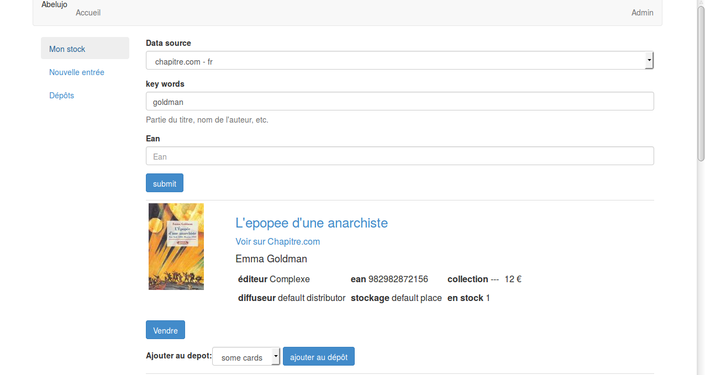

Abelujo - free software to manage small and independent book (and records) shops.
=================================================================================

français: [Lisez-moi](https://gitlab.com/vindarel/abelujo/blob/master/README_fr.md "README en français")

This project is at its debut stage. However it is already possible to:

-   look up for **books**, either by keywords or by isbn/ean. You can currently search for:
    * french books (through [chapitre.com](http://www.chapitre.com/))
    * german books(through [buch-wagner.de](http://www.buch-wagner.de))
    * *you want another one ? The sooner you tell us, the quicker you'll have it ;)*
    * *Note: we have one for Foyles coming (from London)*
-   look up for **CDs** (via [discogs.com](http://www.discogs.com/))
-   choose how many exemplaries you add to your stock, edit the cards,
    search a book in your database
-   choose how many copies you put in what place
-   sell a book.
-   **import data from a LibreOffice Calc file** (.ods). See the [user documentation](doc/user/index.rst "user doc").

We base our work on the software specifications from the Ruche project
(to which we particpated):
<http://ruche.eu.org/wiki/Specifications_fonctionnelles>. We wrote there
what we understood about the work of a bookseller (like how to manage
different distributors, how to manage deposits, etc). You should read it
and tell us wether or not what we are doing will suit your needs (I'll
translate this document to english one day or another, but you should
tell me now if you're interested).

**Abelujo** means Beehive in Esperanto.

Feedback welcomed at ehvince at mailz dot org.

Installation
============

Get the sources:

    git clone https://gitlab.com/vindarel/abelujo.git

it creates the directory "abelujo":

    cd abelujo

Install the required dependencies for Debian (Ubuntu/LinuxMint/etc):

    make debian
    # a shortcut for
    # sudo apt-get install python-pip nodejs nodejs-legacy npm
	# sudo pip install virtualenvwrapper
	# sudo npm install gulp -g  # a JS build system.
    # Debian users have to install nodejs-legacy if the node command doesn't give you a javascript shell.

Create and activate a virtual environment (so than we can install python
libraries locally, not globally to your system). Do as you are used to,
or do the following:

    source venv_create.sh

now your shell prompt should show you are in the `abelujo`
virtualenv. To quit the virutal env, type `deactivate`. To enter it,
type `workon \<TAB\> abelujo`.

To install the dependencies, create and populate the database, run:

    make install

We are done ! Now to try Abelujo, run the development server like this:

    make run
    # or set the port with:
    # python manage.py runserver 9876

and open your browser to <http://127.0.0.1:8000>.

Enjoy ! Don't forget to give feedback at ehvince at mailz dot org !

How to update
-------------

For now, when you update the sources (`git pull`), you certainly will have
to run the installation process again. We may have updated some python
packages and the database is very likely to change too (and we didn't
set up some DB schema migration yet, so you'll have to delete it first,
meaning you'll loose your data).

Development
===========

Django project (1.6), in python (2.7), with AngularJS (1.2)

We use:

-   [jade templates](http://jade-lang.com/), which compile to html,
    and pyjade for the Django integration
-   [Bootstrap's CSS](http://getbootstrap.com) and django-bootstrap3
-   the [AngularJS](https://angularjs.org/) javascript framework.

We are currently working at expanding the database (adding deposits,
distributors, …).

We get the data about books with some webscraping (discogs provides an
api).

You can have a look at the existing scrapers at [search/datasources](search/datasources/). Some
abstraction work remains to be done. And shall we use [scrapy](http://doc.scrapy.org/en/latest/intro/overview.html) ?

You are invited to read the [developer documentation](doc/dev/index.rst).

Load testing data
-----------------

For the moment, we have to delete the current database if the models
change, so we loose our data, but it is possible to load a small set
of testing data::

    make data
    # a shortcut for
    # ./manage.py loaddata dumpdata.json

this will load a handful of Cards, Authors, Publishers and
Baskets. There are already a default Place and Distributor.

Troubleshooting
---------------

If you get:

    OperationalError: no such column: search_card.card_type_id

it is probably because you pulled the sources and didn't update your
DB. As explained, at the moment you need to delete your current DB and
run `make install` again.
