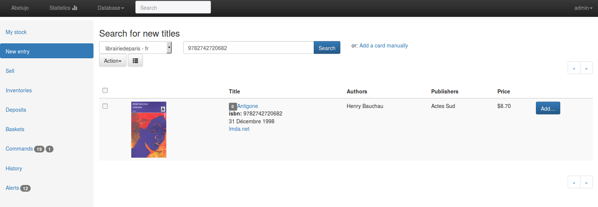

Abelujo - free software to manage independent book (and records) shops.
=======================================================================

français: [Lisez-moi](https://gitlab.com/vindarel/abelujo/blob/master/README_fr.md "README en français")

This project is at its debut stage. However it is already possible to:

-   look up for **books**, either by keywords or by isbn/ean (which works with a **barcode scanner**). See the https://gitlab.com/vindarel/bookshops library. You can currently search for:
    * french books (through [librairiedeparis](http://www.librairie-de-paris.fr/), [decitre.fr](http://www.decitre.fr/) or chapitre.com)
    * spanish books (through [casadellibro.com](http://www.casadellibro.com))
    * german books(through [buch-wagner.de](http://www.buch-wagner.de))
    * *you want another one ? The sooner you tell us, the quicker you'll have it ;)*
-   look up for **CDs** (via [discogs.com](http://www.discogs.com/))
-   do an **inventories** of your stock,
-   manage lists of books, export them to **csv** and **pdf** (with **barcodes**),
-   send an email to distributors to **order** books,
-   manage deposits and distributors, see **the balance of your deposits**,
-   sell books, see conflicts of distributors, see the history,
-   import data from a LibreOffice Calc file (.ods) (experimental, cli only. See the [user documentation](doc/user/index.rst "user doc")).

It is translated to english, french and spanish.

We base our work on the software specifications from the Ruche project
(to which we particpated):
<http://ruche.eu.org/wiki/Specifications_fonctionnelles>. We wrote there
what we understood about the work of a bookseller (like how to manage
different distributors, how to manage deposits, etc). You should read it
and tell us wether or not what we are doing will suit your needs (I'll
translate this document to english one day or another, but you should
tell me now if you're interested).

**Abelujo** means Beehive in Esperanto.

Feedback welcomed at ehvince at mailz dot org.

Installation
============

Get the sources:

    git clone --recursive https://gitlab.com/vindarel/abelujo.git

it creates the directory "abelujo":

    cd abelujo

Install the required dependencies for Debian (Ubuntu/LinuxMint/etc):

    make debian
    # a shortcut for
    # sudo apt-get install python-pip nodejs nodejs-legacy npm
    # sudo pip install --upgrade pip
	# sudo pip install virtualenvwrapper
	# sudo npm install gulp -g  # a JS build system.
    # Debian users have to install nodejs-legacy if the node command doesn't give you a javascript shell.
    # Debian wheezy 7.8: install npm with
    # curl https://www.npmjs.com/install.sh | sudo sh

Create and activate a virtual environment (so than we can install python
libraries locally, not globally to your system). Do as you are used to,
or do the following:

    source venv_create.sh

now your shell prompt should show you are in the `abelujo`
virtualenv. To quit the virutal env, type `deactivate`. To enter it,
type `workon \<TAB\> abelujo`.

To install the dependencies, create and populate the database, run:

    make install

We are done ! Now to try Abelujo, run the development server like this:

    make run
    # or set the port with:
    # python manage.py runserver 9876

and open your browser to <http://127.0.0.1:8000>.

Enjoy ! Don't forget to give feedback at ehvince at mailz dot org !

How to update
-------------

To update, you need to: pull the sources (`git pull --rebase`),
install new packages (system and python-wide), run the database
migrations, build the static assets and, in production, collect the
static files.

In the virtual env, run:

    make update

Development
===========

Django project (1.8), in python (2.7), with AngularJS (1.3)

We use:

- the [AngularJS](https://angularjs.org/) javascript framework with
    [LiveScript](http://livescript.net)
-   [jade templates](http://jade-lang.com/), which compile to html,
    and pyjade for the Django integration
-   [Bootstrap's CSS](http://getbootstrap.com) and django-bootstrap3

See the developer documentation: http://dev.abelujo.cc/

Note::

As a complement to the installion procedure above, you also need to install development dependencies that are listed in another requirements file::

    make pip-dev

We get the data about books with some webscraping (discogs provides an
api).

You can have a look at the existing scrapers at
[search/datasources](search/datasources/). Some abstraction work
remains to be done. To implement your own, see the base class at
`datasources/utils/baseScraper.py`. It's actually very simple, you
just need to find a couple of xpath selectors.

Load testing data
-----------------

It is possible to load a set of testing data::

    make data
    # a shortcut for
    # ./manage.py loaddata dumpdata.json

this will load aprroximately 400 Cards, Authors, Publishers and
Baskets. There are already a default Place and Distributor.

Troubleshooting
---------------

If you get:

    OperationalError: no such column: search_card.card_type_id

it is probably because you pulled the sources and didn't update your
DB. Use database migrations (`make migrate`).

Documentation
-------------

We have developer documentation: http://dev.abelujo.cc/
